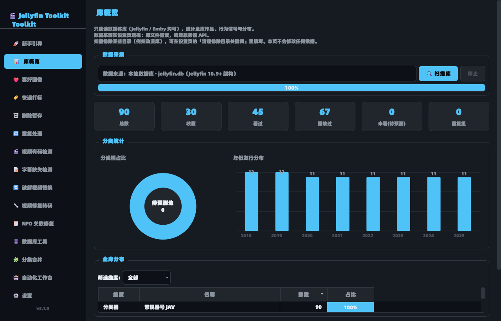
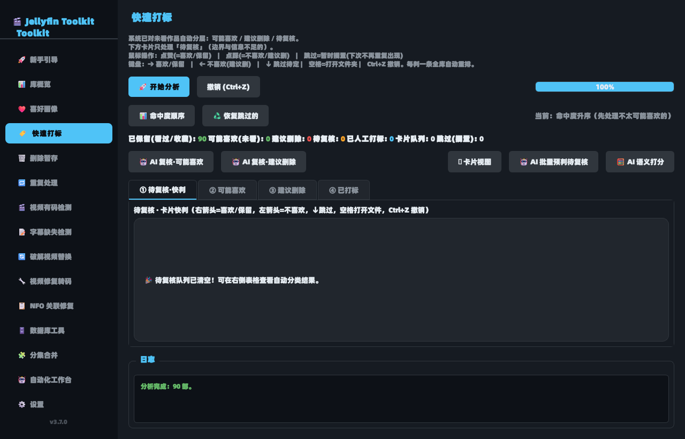
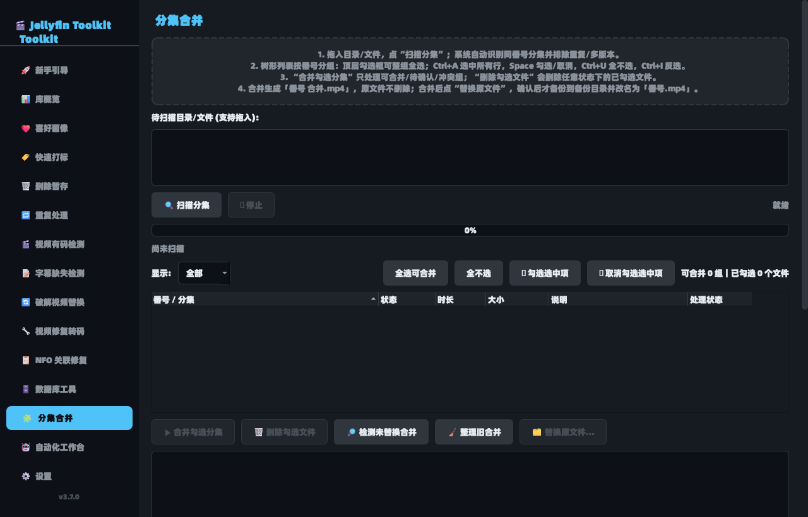

<div align="center">


# Jellyfin Toolkit

**影视库管理工具箱** — 一个桌面端 GUI，把 **Jellyfin / Emby** 媒体库的日常整理工作收进一个窗口。

Jellyfin 与 Emby 的接口同源，本工具**两条都支持**：库数据既可以直读本地库文件，也可以走服务器 API。

[](https://github.com/coldeve2022/JellyfinToolkit/actions/workflows/tests.yml)
[](https://github.com/coldeve2022/JellyfinToolkit/releases)
[](LICENSE)
[](https://www.python.org/downloads/)
[](#系统要求)

</div>

---

## 它解决什么问题

Jellyfin 本身是个很好的媒体服务器，但**整理库**这件事它不管：

- 哪几部其实已经看腻了，可以删？
- 这个番号的 CD1/CD2 是不是该合起来？
- 哪些视频缺字幕、哪些 NFO 和文件名对不上？
- 库里混着无码/破解版本，怎么快速筛出来？
- 转码修复要一个个开命令行敲 ffmpeg？

这个工具把这些都做成了带界面的操作，**而且所有破坏性动作都先备份、可回滚**。

> ⚠️ **运行前请先备份媒体库。** 工具设计了回收站/备份/日志回滚，但任何批量文件操作都有风险。

---

## 主要功能

| 页面 | 能力 |
| --- | --- |
| 🚀 新手引导 | 首次运行的分步指引 |
| 📊 库概览 | 只读读取媒体库（库文件直读或服务器 API），统计作品总数、年份/厂商/演员分布、收藏/看过/未看规模、重复组数量 |
| ❤️ 喜好画像 | 从你的收藏与观看行为生成个人口味画像（Top 演员/厂商/类型），输出未看推荐 Top 20，可导出 CSV |
| 🏷️ 快速打标 | 卡片式快节奏打标（喜欢 / 不喜欢 / 跳过 / 删除），反馈实时重排评分 |
| 🗑️ 删除暂存 | 低命中度作品清单 + 删除理由，移入系统回收站并记日志 |
| 🔁 重复处理 | 识别同番号的不同版本/分辨率，分组勾选，保留最优 |
| 🎬 视频有码检测 | 按关键词把库分成有码/无码，可按演员清理未知占位 |
| 📝 字幕缺失检测 | 扫描目录，找出没有同名字幕的视频（支持断点续传） |
| 🔄 破解视频替换 | 把 `xxx.restored.mp4` 替换回库中对应位置 |
| 🔧 视频修复转码 | 检测损坏/不兼容文件，GPU 加速修复或转码为 Jellyfin / Emby 兼容 MP4 |
| 📋 NFO 关联修复 | 修正 NFO 文件名与内容对不上的问题 |
| 🗄️ 数据库工具 | 检查表结构、跨库转移数据、清理 `.ts` 残留 |
| 🧩 分集合并 | 把 CD1/CD2 无损合并为单文件（`-c copy`，不重编码），确认替换前先备份原分集 |
| 🤖 自动化工作台 | 把上面的步骤串成一条可无人值守的流水线（默认 dry-run） |

另外提供两个无界面 CLI 入口：`auto_orchestrator.py`（全库审计/编排）与 `auto_pipeline.py`（合并流水线）。

---

## 截图

| 库概览 | 快速打标 | 分集合并 |
| --- | --- | --- |
|  |  |  |

<sub>截图使用 `tools/dev/seed_demo.py` 生成的**虚构**演示库，不含任何真实数据。</sub>

其余页面截图在 [`docs/images/`](docs/images/)。

---

## 系统要求

| 项目 | 要求 |
| --- | --- |
| 操作系统 | Windows 10/11、macOS、Linux（有 PySide6 的平台都能跑） |
| Python | 3.9 以上（推荐 3.11 ~ 3.13） |
| 依赖 | `PySide6` |
| 外部工具 | **FFmpeg / ffprobe**（视频修复、转码、分集合并需要；其余功能不装也能用） |
| 可选 | **Jellyfin 或 Emby** 服务器 + API Key（「脏标签清洗 + 全库刷新」用到；也可用它来读取库数据） |
| 可选 | 本地 LLM（Ollama / LM Studio 等 OpenAI 兼容接口，用于 AI 复核） |

FFmpeg 不需要装在 PATH 里 —— 可以在「设置 → FFmpeg 转码设置」里手动指定路径，
或直接把 `ffmpeg.exe` / `ffprobe.exe` 放到程序目录的 `bin/` 子目录下。

---

## 安装与运行

### 方式一：下载打包好的 exe（Windows）

1. 到 [Releases](https://github.com/coldeve2022/JellyfinToolkit/releases) 下载 `JellyfinToolkit-vX.Y.Z-win64.zip`
2. 解压到任意目录
3. 双击 `JellyfinToolkit.exe`

> 数据写在 `%APPDATA%\JellyfinToolkit\`。
> 想做成绿色便携版：在程序目录里新建一个空的 `portable.txt`，数据就跟着程序走。

### 方式二：从源码运行

```bash
git clone https://github.com/coldeve2022/JellyfinToolkit.git
cd JellyfinToolkit

# Windows：一键创建 .venv 并启动
start.bat

# macOS / Linux
chmod +x start.sh && ./start.sh

# 或者手动来
python -m venv .venv
.venv/bin/pip install -r requirements.txt    # Windows: .venv\Scripts\pip
python main.py
```

Windows 下还可以双击 `start-silent.vbs` 无控制台启动。

### 环境自检

不确定 FFmpeg 装好没有？跑一次自检：

```bash
python main.py --doctor
```

它会打印数据目录、实际的 ffmpeg/ffprobe 路径，以及**在本机实测可用**的硬件编码器与硬解方式。
界面里也有对应入口：「设置 → FFmpeg 转码设置 → 🩺 环境自检」。

### 想先看看长什么样？

不用准备媒体库，生成一套虚构演示数据即可：

```bash
python tools/dev/seed_demo.py --out ./demo
python main.py --data-dir ./demo
```

---

## 数据与隐私

这一节请认真看 —— 这个工具会读取你的媒体库路径和观看记录。

**它不会做的事：**

- ❌ 不上传任何数据，没有遥测、没有统计上报、没有内置第三方域名
- ❌ 不联网（除非你**主动**配置了 Jellyfin 服务器地址或本地 LLM 接口，且只连你自己填的地址）
- ❌ 不修改你的媒体库数据库（读取 Jellyfin `jellyfin.db` / Emby `library.db` 时一律使用
  SQLite `mode=ro` + `PRAGMA query_only=ON`；走 API 采集时只发 GET）

**它会把数据写在哪里：**

| 内容 | 位置 |
| --- | --- |
| 配置 | `<数据目录>/config.json` |
| 打标记录、画像缓存 | `<数据目录>/data/smart.db`（SQLite） |
| 删除留痕 | `<数据目录>/data/trash_journal.db` |
| 分集归档日志 | `<数据目录>/data/merge_archive_journal.json` |
| Jellyfin 标签清洗备份 | `<数据目录>/data/jellyfin_clean_backup_*.json` |
| 运行错误日志 | `<数据目录>/app-error.log` |

`<数据目录>` 默认是：

- 打包运行 → `%APPDATA%\JellyfinToolkit`（macOS：`~/Library/Application Support/JellyfinToolkit`；Linux：`~/.config/JellyfinToolkit`）
- 源码运行 → 项目目录
- 便携模式 → `程序目录/AppData/`
- 环境变量 `JELLYFIN_TOOLKIT_DATA_DIR` 优先级最高

**卸载 = 删掉程序目录和上面这个数据目录。** 没有注册表残留，没有隐藏的服务。

> 仓库里**不包含**任何真实配置或个人数据。`.gitignore` 与 CI 中的隐私守卫 job 会双重拦截。

---

## 配置

图形界面覆盖了绝大多数选项（「⚙️ 设置」页）。配置项的含义见 [`config.example.json`](config.example.json)，
把它复制成 `config.json` 放进数据目录即可做默认值预设。

几个容易踩坑的点：

- **`merge_backup_root`（备份根目录）**：留空 = 落到数据目录下的 `backups/`。
  填写的盘符如果在当前机器上不存在，程序会**自动清空该字段并回退**，不会因为一个失效盘符让整个功能报废。
- **`ffmpeg_gpu_codec`（编码器）**：留空 = 自动。程序会**真跑一次编码**来确认本机可用性，
  而不是读 `ffmpeg -encoders` 的编译期列表（那份列表在绝大多数机器上都会谎报 Intel/AMD 硬编可用）。
- **`exclude_path_keywords`**：不想让某些目录进入分析（比如动漫库），在这里写路径关键词。

### 媒体库数据源（Jellyfin / Emby）

程序需要知道"从哪儿读库"。两种方式任选，也可让它自动挑：

| `library_source` | 行为 |
| --- | --- |
| `auto`（默认） | 能读到库文件就用库文件；读不到再走服务器 API |
| `db` | 只读本地 `jellyfin.db` / `library.db`，不依赖服务器在线 |
| `api` | 只走 REST API（**Emby 推荐**：不要求库文件在本机，NAS / Docker 部署也能用） |

- **库文件路径留空 = 自动检测**，会扫描 Jellyfin 与 Emby 在各平台的官方默认安装位置。
  也可以在「设置 → 媒体库数据源」点「自动检测」。
- **库文件架构自动识别**：Jellyfin 10.9+ 的 `jellyfin.db`（EF Core 架构）与
  Jellyfin ≤10.8 / Emby 的 `library.db`（`TypedBaseItems` 架构）都能读。
- **服务端类型留 `auto` 即可**：程序读 `/System/Info/Public` 的 `ProductName` 自动判断
  是 Jellyfin 还是 Emby（该接口不需要 API Key）。
- **API Key 怎么拿**：Jellyfin → 控制台 → 高级 → API 密钥；Emby → 设置 → 高级 → API 密钥。
  两者认证头相同（`X-Emby-Token`），所以填一处两边通用。

---

## 常见问题

<details>
<summary><b>视频修复 / 转码 / 分集合并用不了，提示找不到 ffmpeg</b></summary>

FFmpeg 没装或不在 PATH 里。三种解决办法：

1. 「设置 → FFmpeg 转码设置 → 浏览」，直接指定 `ffmpeg.exe`
2. 把 `ffmpeg.exe` 和 `ffprobe.exe` 放到程序目录的 `bin/` 子目录
3. 安装 FFmpeg 并加入系统 PATH

装完点「🩺 环境自检」确认路径对了。
</details>

<details>
<summary><b>选了硬件编码器，一执行就报错（MFX session / amfrt64.dll / nvenc not found）</b></summary>

说明这台机器没有对应的显卡或驱动。把编码器改成「自动」，程序会实测后挑选可用项；
即使手工选了不可用的，执行时也会自动回退 `libx264` 并给出提示，不会直接失败。
</details>

<details>
<summary><b>界面中文显示成方块</b></summary>

系统缺少中文字体。Linux 上装一套即可：`sudo apt install fonts-noto-cjk`。
程序会按平台探测可用字体，但系统一个中文字体都没有时无能为力。
</details>

<details>
<summary><b>分集合并后原文件去哪了？</b></summary>

先备份到你配置的备份根目录（默认为数据目录下的 `backups/_merged_originals/<番号>/`），
然后合并文件改名为「番号.mp4」。整个过程记录在归档日志里，
「分集合并」页可以按单个文件回滚。
</details>

<details>
<summary><b>「删除」会真的把文件删掉吗？</b></summary>

会移到系统回收站（Windows 回收站 / `gio trash`），并写入删除留痕数据库。不是 `rm`。
</details>

<details>
<summary><b>我用的是 Emby，能用吗？</b></summary>

能。先在「设置 → 服务器同步」填 Emby 地址（默认与 Jellyfin 同为 `8096`）和 API Key，
点「🔌 测试连接」应显示 `Emby · 服务器名 · 版本`；再把「媒体库数据源 → 数据来源」
设为「服务器 API」（或保持「自动」）。这样不需要在本机找到 Emby 的库文件，
服务器装在 NAS / Docker 里也能用。

注意两点：

- Emby 的库文件结构随版本变化，所以**推荐走 API**；若确实要用本地库文件，
  程序会按传统架构读取，但播放记录（收藏/次数）在 Emby 里存在独立的 `users.db`，
  仅凭库文件读不到 —— 这时日志会明确说明，而不是把数据当成 0。
- 「数据库工具 → 跨库转移播放记录」需要本地库文件，Emby 或服务器在别的机器时用不了。
</details>

<details>
<summary><b>AI 复核连不上</b></summary>

AI 功能是可选的，连不上不影响其他一切。默认地址 `http://localhost:11434/v1` 是 Ollama。
没装 Ollama 或没拉模型时，请在设置里关掉「启用」。
</details>

---

## 项目结构

```
jellyfin-toolkit/
├── main.py                  # GUI 入口（--doctor / --version / --portable）
├── config.py                # 配置与数据目录解析（跨平台 + 便携模式）
├── version.py               # 版本唯一来源
├── ui/                      # PySide6 界面
│   ├── main_window.py       #   侧边栏导航 + 页面路由 + 主题
│   ├── theme.py / styles.py #   颜色 token 与 QSS（禁止硬编码颜色）
│   ├── widgets.py           #   通用控件（拖拽列表、图表、日志面板…）
│   └── pages/               #   15 个功能页
├── workers/                 # QThread 后台任务（扫描/分析/转码/合并…）
├── utils/                   # 与 Qt 解耦的纯逻辑层（可单测）
│   ├── tools.py             #   外部工具定位 + 硬件能力**功能探测**
│   ├── fonts.py             #   跨平台字体探测
│   ├── media_server.py      #   Jellyfin / Emby 类型识别 + 本机库文件定位
│   ├── library.py           #   库文件采集与构模（自动识别两种架构）+ build_item 归一化
│   ├── library_api.py       #   走 REST API 采集库（Jellyfin / Emby 共用）
│   ├── library_source.py    #   数据源统一入口（库文件 / API 二选一）
│   ├── scoring*.py          #   命中度评分引擎 v1/v2
│   ├── merge*.py            #   分集合并与安全归档/回滚
│   └── ...
├── automation/              # 无界面编排流水线
├── tools/
│   ├── make_icon.py         # 生成多尺寸 ico（可重复运行）
│   ├── make_version_info.py # 生成 exe 版本资源
│   └── dev/                 # 手动脚本（pytest 不收集）
├── scripts/build_release.py # 一键打包：图标 + 版本资源 + 测试 + PyInstaller + zip + SHA256
└── tests/                   # pytest（370 项）
```

---

## 开发

```bash
pip install -r requirements-dev.txt

pytest -q                       # 全部测试（离屏运行，不弹窗）
ruff check .                    # 静态检查
python tools/dev/seed_demo.py   # 生成虚构演示库
python tools/dev/make_screenshots.py   # 重新生成 README 截图
python scripts/build_release.py        # 打包出 dist/ + zip + SHA256
python tools/dev/smoke_exe.py          # 验证打包产物真能启动
```

约定与红线见 [CONTRIBUTING.md](CONTRIBUTING.md)，改动记录见 [CHANGELOG.md](CHANGELOG.md)。

**两条硬规则：**

1. **个人数据永不入库。** 真实 `config.json`、`data/`、媒体路径清单一律 gitignore；
   CI 有独立的隐私守卫 job 做二次拦截。
2. **破坏性操作必须先备份、可回滚、有日志。**

---

## 许可

[MIT](LICENSE)

本工具与 Jellyfin 官方无关联，为社区第三方工具。
请确保你使用它管理的媒体内容来源合法。
